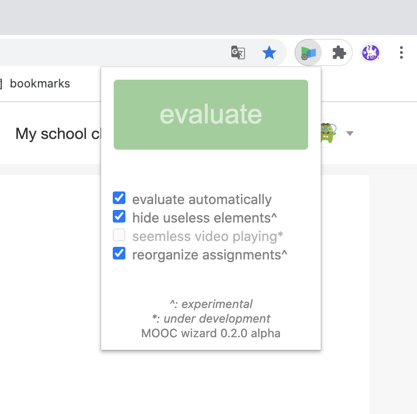

# MOOC-wizard
>_a small chrome extension for 163-mooc (icourse163.org) users._

**Not meant to finish exam or homework for anyone, but committed to optimize your studying experience on 163-mooc.**

## Functions
(in the latest version: 0.2.0_preview_alpha)  

 

### Evaluate! and evaluate automatically
MOOC-wizard can help you to evaluate others' homework to save your time.  
Click **Evaluate!** button to evaluate for a single time.  
When **evaluate automatically** is on, once you enter the evaluation page, evaluation will be done automatically.  
 

### Hide useless elements (experimental)
With MOOC-wizard, the 163-MOOC webpage will be nice and clean.  
 

### Seemless video playing (under development)
This function is under development, but you are encouraged to contribute to it.  
 

### Reorganize assignments (experimental)
Assignments on 163-MOOC are by default in chronological order.  
MOOC-wizard can reorganize them, by pinning the assignments that are about to expire, and list the passed things behind.  
 

## Download and install
This extension is made without any attempt on profit.  
To download the extension, please click here.  
Don't know how to install? Search the Internet!  
 
